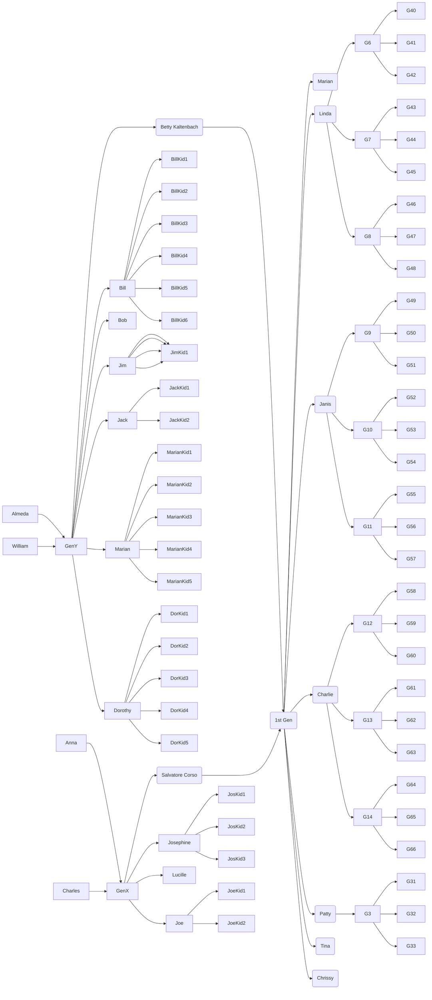

## This is a draft of our family genealogy. 

The chart must be viewed directly within the GitHub repository.

[Link](https://github.com/corsokalte/corsokalte.github.io/blob/main/_posts/2023-03-04-Family%20Genealogy.md)

